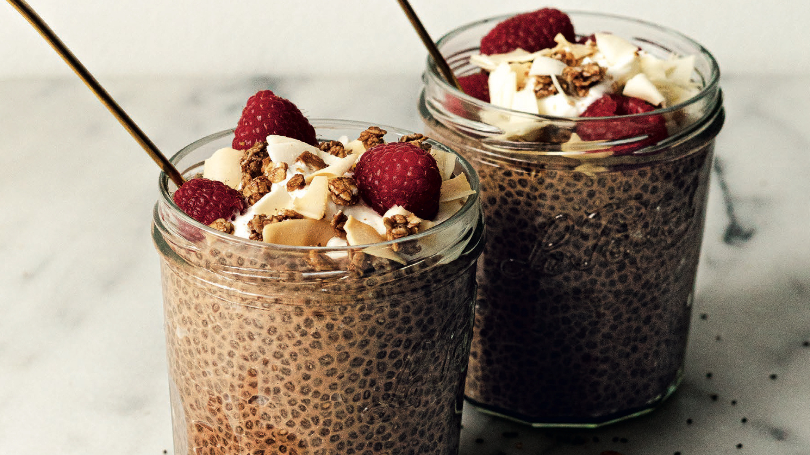

# Brownie Batter Chia Pudding

## Ingredients:

- 1 cup canned full-fat coconut milk, plus more as needed
- ½ cup water
- 1 tablespoon raw cacao powder
- 1 to 2 tablespoons maple syrup
- ¾ teaspoon vanilla extract
- ¾ teaspoon chaga powder (optional)
- Pinch of salt
- 3 tablespoons chia seeds
- Granola, toasted coconut flakes, strawberries, and/or raspberries, for serving (optional)

## Direction:

- In a medium-sized jar or bowl, combine the coconut milk, water, cacao, 1 tablespoon of the maple syrup, the vanilla, chaga (if using), and salt. Whisk well. Stir in the chia seeds. Taste and add the remaining 1 tablespoon maple syrup if necessary.
- Cover and refrigerate for at least 3 hours or overnight, until the chia seeds have absorbed the liquid and the mixture has a pudding-like consistency. (if the mixture is thicker than desired, stir in a splash of water or milk.)
- Serve with any or all of the suggested toppings.
 

